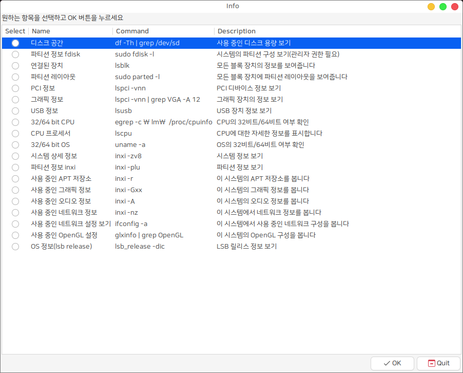

# inxi-gui

시스템 정보를 보는 GUI 도구 (Simple gui front end to inxi)




# Install

## HamoniKR (>= 3.0)
```
sudo apt update
sudo apt install -y inxi-gui
```
## Ubuntu (>= 18.04), LinuxMint (>= 19.1)
```
wget -qO- https://pkg.hamonikr.org/add-hamonikr.apt | sudo -E bash -
sudo apt inxi-gui
```

# License
 * [View license](./LICENSE)